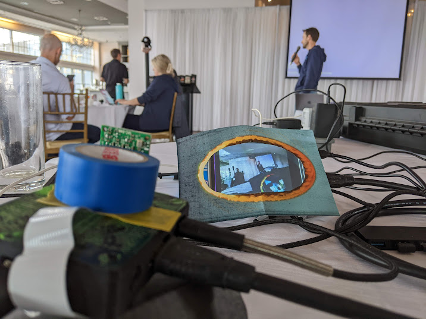
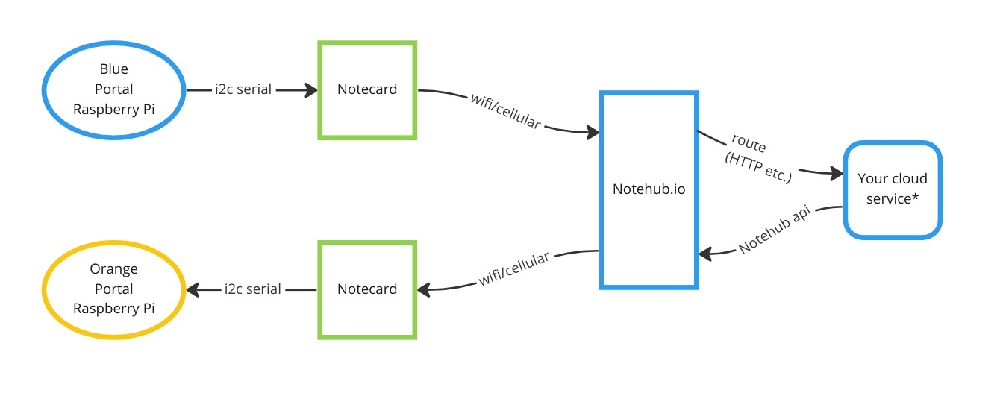

# Notecard-Powered Photo Portal

This is a rough draft python program which allows two Raspberry Pi systems, each
equipped with a webcam and HDMI screen, to work like a portal in the Portal
video game. That is, each screen shows the output of the opposite camera, much
like a super slow video conference on two smartphones using their rear cameras. 

> See the 'blue' raspberry pi and camera on the left under the roll of blue
> electrical tape, and the 'orange' raspberry pi's screen above.

## Configuration

[config.py](config.py) contains the variables you need to set for your environment.

## Communication

The two portals communicate via Blues Wireless [Notecards] (cellular or wifi) to
Notehub.io, a secure cloud data routing service.

 \* the cloud service is not shown in this repo and is left as an exercise for
   the reader. See the [Notehub Route Tutorial] and [Notehub API introduction].

## TODO

- Display the image right from python. Currently it needs to be done by a
  separate linux process.
- Test the latest refactor on a Raspberry Pi which I sadly don't currently have.
- Test your image payloads. Keep them as small as you can. 8kB is way too big.
- While testing your use case, keep an eye on notecard flash storage usage
  percentage (printed out after sending each frame.) Note the Notecard usually
  has about 700kB note storage, but less in some circumstances like during DFU.
- Check notecard api responses for `err` messages and handle appropriately.

## Data Format

Images are captured as jpg, resized to 240x400, compressed into WebP at low
quality (0-2 on a scale of 0-100), encoded as base64, and put into a json
body suitable for the Notecard JSON API.

### Example Compressed Image (3.3kB WebP)

### Example JSON Body (valid, but does match the WebP above)

`
{"destDeviceUID":"dev:5c02723120f3","image":"UklGRrQIAABXRUJQVlA4IKgIAABQFgCdASrwAMgAP73e6W6+N7AqojO5E8A3iWNttqQsohAsJC8RbxM+U8fBfMQU7B0L7vkNxmlFJQ//6+dfSXTxWfENu4cz53HYyYdCclVdz/JR+WfgGRjcZ0QtijSiwXeprrx82FW8yaPcXSKf959acNZUB1s+fCweg10kZokyuMJPQI9I0dB4Y5lr3Gmz6IAUXmcfi3JGqSn6EWT114q9XWd3lVKRnz4lCag7Ctw8tfz1njb2DRBtUwPAAP7Z9DGR3Lq0PBKXrhqZnB2leuXyY9Uk6QwkCdcEWV+iCcj0G2rQDY0Bl0sfh3yZgOGIIyf60+/Oj5IxEMMdMaNNIoUrvb3lBrZ9PPNN+yXw+5Cd1Wkx9dE1ICrllT9erGQ4MHr5JRB1AlRqddS4baN54fHffyAd/Dwgeu0NHZCKmGbPQ5pUvO8O+8SVavvR5Y2pRmP34ydHn/+rdRGxE7fjK/+3dDneLO5+xWwzb4vY63PEOcI0YMI3YNNZmPHbQXwtqdFvgmreexF+NAGx8ecmjbXuPIm6GH+5kIQn6+b8A95k0HBbEkuwDeBN808JiLsZyMs61CwLYlUvqekD33xJF1X1HO7B4vs+44/5P6FzAp/HoTSGUEu584CrtoMI6rRZxi9n+E9l7HZN7TfFe933XZB8qi9Dh/g+H2oQil/ko2J7QhdEasrCF1LOHjtnOeIfWLecVRiz7WVY7/2eGdWB/SJSFU18nn0X67aZrOiy0E4/YuzqrbPoHZNelkeEtUpPSZ7JlUh7QPiqvujGqo+isuki4Nv8ic944eGhLr0/zfAI7Zmdd0uPYDn6Z7KvvIfU+peBHWC/rKv25Tu45UcurDlfZj1wXZ2WVruM/e5a2kRbsMxvswM3jLqP++I18qH2RZn7LssagcbrPfXmFlV/yqjF1sl33uvec72ZTu2KnZlH4heQFw7OsWSMLshMLyMx4Y99+DksYl6NsSURoxsbIzpT1CGmFxjPZnAovy3mmfAmAHYfB1ig9/lpdI7A8qPK2HU73lLNTrU8UjOctDhl+AHNh+pRCcm/OcEbBbagsMNGUMy/k1Cj8oQ9WgIhOmCa56Kvf6/zLYnF/9wae2aoVYNHBOw0W5PnhTUV+dMQzuYQMy1DYbN9Slr8q0QsZtH/jJmwG14FgbeYM+XGIin+Ps5AfBe/uY16beM7hXzxKC3JTtH+877jMX+iNyVK4bd5lI166zfV6ERLTfGnUKdshaPu2UT/kRxmOaHkCVjxcqe8T965yNoDQIyl353vZNLltEPhSRhHARwuWs9tCGq+c1/G+ahQFUgw+U9WV/bOKwPYpC3dtF9q40kUIPLz13kbGxPwOx7SsdB2qEKmvhdk6j/jK4l/8WJYl2JX1JHfZEAPESzk3sL5/e2reMK+DzfrYu3pceKl1Ulr+1yX3DsFsD06Mo4T7/o5FOznauASR8nvg4YziBHsR74wT1ZMLHTz4gVIDrznPrdXgdxtpNBFcE9j46qMWq2wh5Wc9MiWaH8am6wntOn6cuf4pvmZkSPDG43aiAu8Ld8pUPaBxCKG4hnr033qYpmixOE6fCUeSxmIaKdISlmHMMhUoAwDue+OhwKFJeS4XBf8khj3AT+qosJm9ccOMKja/GZMeYqWkBgutDSavcn1GhXbV4dwT3juWGRg5Snl5+/3d+7yl68S/FmCGgYJgKibe0f2AgRrxFqXg+Ub+IzMK6l47/uYGHjRll/6M3z4oXw4/8ySy8Imfqjw0+11NO+VvyoSij4pHQeTvLLVMws+wiYXmIOCFGPkxbnNiSmbFmM5dTsvdVyMKntdubtcZzmjf0r+1/rpvEoQP9S/JGETVXbU7GLcwYXGubb3TGoC66UiqD2VE3X9v0baUFVD8o2R5TRbf2Ve5JUSY7FBeYR0QmdlTksyhQPNkU2Ufbhb7u6fGF9LcDKskiQEJtpgeD/e/QU/D+5TmHcxPD7yomj4fm1wAt4ldf5UNCeew/jzpJQMMOIKHEcTRvFJVxuiUdy913oeu9LuLmtBnaagehxzoqp92hxAUD2Tk8LdcKIRs7ADGMxDKw7sfM/+zE83Iyv8YT5utQYL7wqTSTqxTC7hrX8Sk8n0fVx90Qr8NLmOIfGBQN8tkXbLmNPPj2TD/rL1faTHiCL/WVcGhvSWT+OUCsoqUElUdX1wjm00TZRpk5C0wHvfAiqiwpH0thxUsL6rz4PR1FobtZOLSO1Yro/6DOf5/xGFWzomOJ95yVAr5tnGGE8K5pUqJ9zy4UkNgS0TINNqAf2I1ZpBe/ubNjQuq563BxF9rLeJlgaiibCnuOT4kESyfEiovhxvbKEg1/ogUuiwt2ftdrf8ch56rtNT9lnmYM8SGFR1bb+ETyY7su88PqzA4beRq4mAspy3uqBL+cwLGVe8KhB4Z7liuaVCmFs1pX2p06rtKdAsWvtL0TvKbCz6mvhZLMOnh5m0tLt1fwKojCs7j4ExuG3Sn7ZqWioU8H4P3Uy6OmEc+VOoZgbsJpgTl3VxvOnik6Jk9i+H+2rlu5Mr7ntxVXze+8jlNfNWf+Qv2XoZ+7sjCVEjnlx6TPhM9m8nm79I6EW5v9mZYOGN0f45072r/V6Zaxzy89Q0fDHl9DbW90S0po6xnRIti5r2+zhXNWRaoZMXFvULugAqAO8mKCsWJDUOO7i/tszo4oab8nOKTa7WtiFK75r0Ow0O/FbCkfBuy0/vYvtsOk4OaeFYjSt/PXLPomBkesi851NTLnEK3v2imr8bpzks1iqbZWDkIG303VTJ8pj71MvPCLJS4ftMVISjbjlgrp1e1s9CZMyWUR6Agug3qCsv9GU1zXYEPa/8pDxdN+nTsdRQFtQN+XlrX5n7e8RHUlOTjGZySf3qJHcIVBHAexOJJWLfSptTv/8c/tVa4QONKfO1YxJzuq/FXbstKw9nU7iCD7ddmANnFR8FBLwHYYHAAA=="}
`

[notecards]: https://blues.io/products/notecard/
[notehub api introduction]: https://dev.blues.io/reference/notehub-api/api-introduction/
[Notehub Route Tutorial]: https://dev.blues.io/guides-and-tutorials/routing-data-to-cloud/general-http-https/
